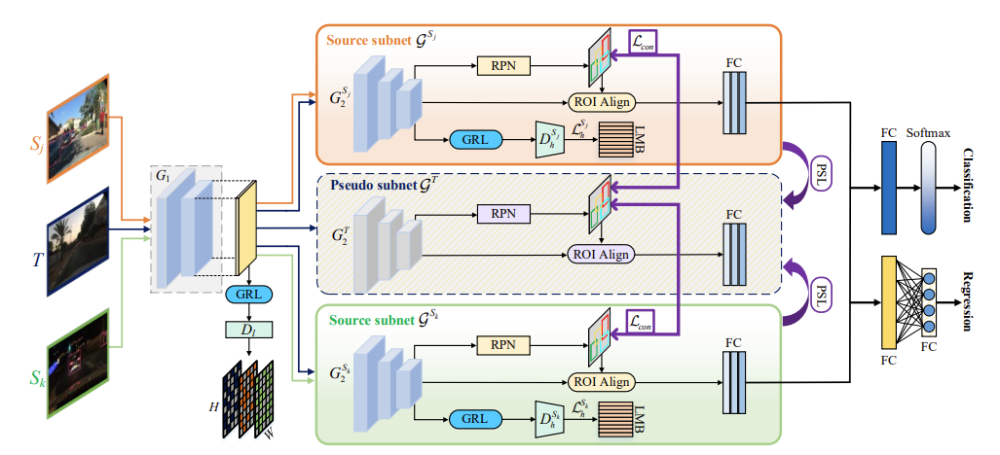

# DSMN_github
Multi-Source Domain Adaptation for Object Detection ICCV 2021

# Installation

## Prerequisites

- Python ≥ 3.6.7
- PyTorch ≥ 1.7.1 and torchvision that matches the PyTorch installation.
- torchvison ≥  0.8.2

## Install python env
cd DSMN_github/lib

python setup.py build develop
